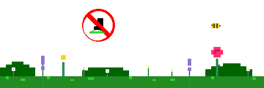

# Hi there, I'm Simone! 👋

I'm a Computer Science student 🤓💻 at UniCT, nothing less than in Sicily! While waiting for the next Etna🌋 eruption to cover my balcony in ash, I keep myself busy tinkering with code and learning new tech.

- 🎓 **Education:** Currently pursuing a Master's degree in Artificial Intelligence.
- ⚡ **Interests:** Gym, video games, anime, TV series and **plants & flowers** 🌿.

 
 

  **While you scroll down, be careful to not step on the grass!**

 

 

 

 

- 🔭 **Current Projects:**
  - **HAIDE** 🇧🇬
    A gamified mobile app to learn Bulgarian (inspired by Duolingo). The goal is to finally communicate with my girlfriend's family! 
      
    - **Focus**: Cross-platform UI, Real-time Database, Auth.
    - **Status**: In development.

  - **Virtual AI Spotter** 🏋️‍♂️
    A Computer Vision assistant for real-time form analysis and automatic rep counting. 
      
    - **Focus**: Pose Estimation, Geometric Analysis, FSM Logic.
    - **Status**: In development (MVP targeting Squat and Curl).

  - Gym-wise, I'm grinding to finally unlock the **Muscle-Up**! ✨

  

